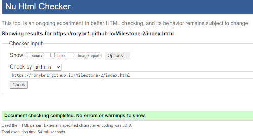
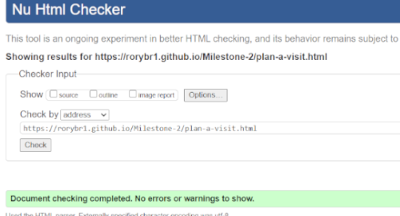
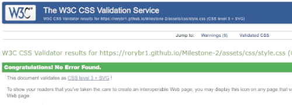
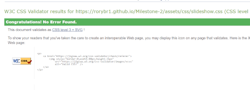
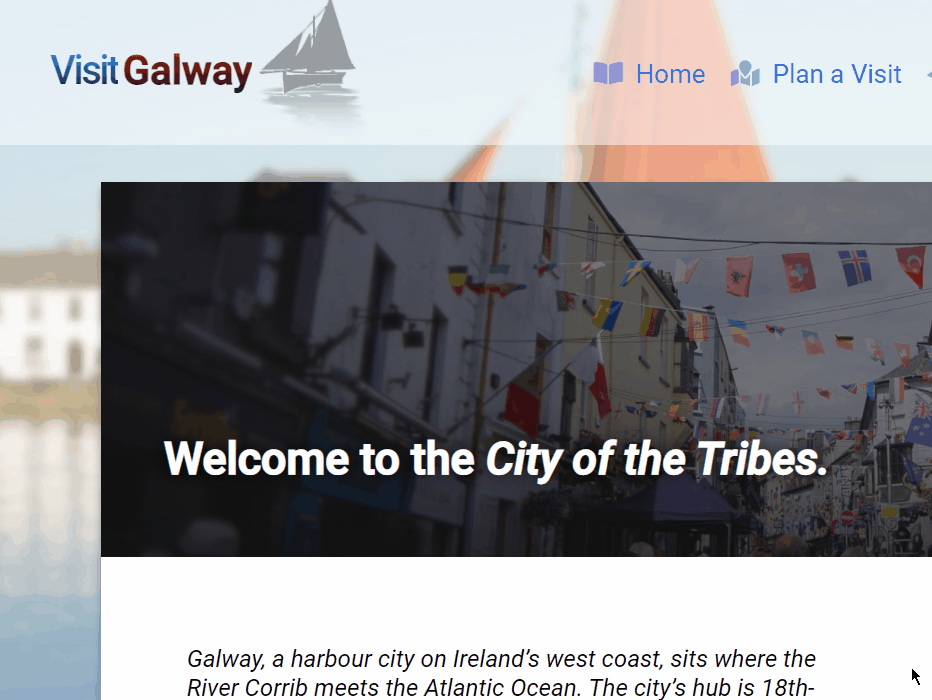
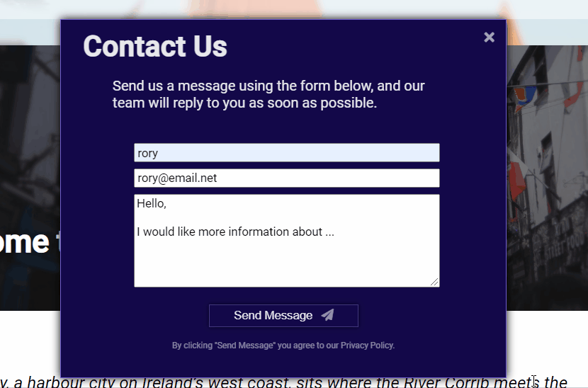
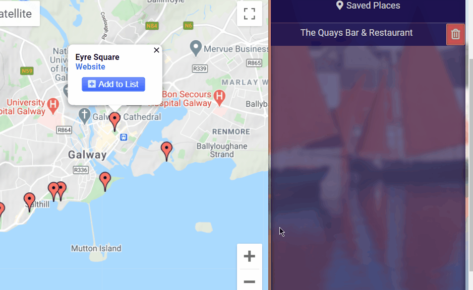

[ 🠔 Back to ReadMe ](../readme.md)

# Testing

## Table of Content 
1. [W3C & JSHint Validation](#html)
    * [Index.html](#Index)
    * [Plan-a-visit.html](#Plan-a-visit)
    * [/assets/css/style.css](#Style)
    * [JavaScript](#JavaScript)
2. [User Stories](#user-stories)
3. [Feedback](#feedback)

<hr>
<hr>

## W3C Validation 
### HTML
*index.html* and *plan-a-visit.html* were both put through the [W3C HTML Validator](https://validator.w3.org/)
* ### Index
    The following errors were found and corrected

1.   
    ```
    Error: Bad value 120px for attribute height on element img: Expected a digit but saw p instead.
     From line 31, column 13; to line 31, column 131
     < img src="assets/images/hooker.png" alt="Galway Hooker, type of fishing boat home to Galway." id="hooker" height=120px >↩     
     ```
    "height=120px" corrected to "height=120".

2. 
    ```
    Error: Element a not allowed as child of element ul in this context. (Suppressing further errors from this subtree.)
     From line 49, column 13; to line 49, column 50
     < a href="index.html" class="nav-link" >↩     
    ```

    This same error was found for the "Plan A Visit" and "Contact" links in #mobile-nav. The "Ul" element was changed to a "nav" element.

3.  
    ```
    Error: Bad value for attribute action on element form: Must be non-empty.
     From line 68, column 10; to line 68, column 43
     ↩         < form id="contact-form" action="" >↩    
    ```

    action="" was removed.

4.  
    ```
    Error: Stray end tag i.
     From line 73, column 98; to line 73, column 101
     lane">< /i >< /i >< /butt 
    ```

    The stray < /i > tag was removed.

5. 
    ``` 
    Error: A slash was not immediately followed by >.
     At line 153, column 17
            < br/  >↩      
    ```  

    Several < br/ > tags written incorrectly written with a space before the closing bracket. The spaces were removed.

6. 
    ```
    Error: Stray start tag script.
     From line 159, column 73; to line 159, column 106
     ton): --> <script src="assets/js/toggle.js"></scri 
    ```
    Script tag was outside of < body >. All script tags were moved to within < body >.

7. 
    ```
    Error: Element li not allowed as child of element a in this context. (Suppressing further errors from this subtree.)
    From line 50, column 19; to line 50, column 32
          <li id="home"> <i cl 
    ```
    
    < li > elements were changed to < div > elements.

After these errors were corrected, the HTML passed without error or warning. 



[Back to top](#testing)

<hr>

* ### Plan-a-visit
The following warning was found

1. 
    ```
    Warning: Consider avoiding viewport values that prevent users from resizing documents.
    rom line 20, column 7; to line 20, column 115
    pt>↩      <meta name="viewport" content="width=device-width; initial-scale=1.0; maximum-scale=1.0; user-scalable=0;" />↩   </
    ```

* A fix was found [here](https://www.webdeveloper.com/d/367195-avoid-validation-warnings-on-meta-viewport/2) and implemented.

    After this was corrected, the HTML passed without error or warning. 

    

[Back to top](#testing)

<hr>
<hr>

## CSS
All CSS was put through the [W3C CSS Validation Service](https://jigsaw.w3.org/css-validator/).

* ### Style
    
    Located at assets/css/style.css. 
    The following errors were found and corrected.

1. 
    ```
    14  	::selection	Value Error : color none is not a color value : none
    ```

    The line was removed as it was unnecessary. 

2. 
    ```
    62	#visit	text is not a background-clip value : text
    74	#galway	text is not a background-clip value : text
    ```
    These lines were removed to satisfy the validator as they did not affect the rendering of the page.

3. 
    ```
    134	.welcome-text	Value Error : width only 0 can be a unit. You must put a unit after your number : 80
    ```
    This line was removed as it was redundant.

4. 
    ```
    140	.welcome-text	rgb(255, 255, 255, 0.6) is not a box-shadow value : rgb(255, 255, 255, 0.6)
    ```

    This line was removed as it was redundant.

5. 
    ```
    676	#menu-button	0.1 is not a animation-duration value : 0.1
    ```

    The value was corrected to be a unit in seconds.

6. 
    ```
    720	ul	Property padding-inline-start doesn't exist : 0
    ```
    This line was removed as it was redundant.

    After these fixes, the CSS passed the validator without error. 

    

    <hr>

* ### Slideshow.css
    Located at assets/css/slideshow.css.
    The CSS passed the validator without error.
    

[Back to top](#testing)

<hr>
<hr>

## JavaScript
#### The following files in assets/js/ were passed through [JSHint](https://jshint.com/)

* todoList.js
* toggle.js
* map.js

    Warnings included use of template literals for compatibility reasons. A developer decision was made to continue using template literals as they are supported by most browsers and are common JavaScript developer practice. 
    Warnings about undefined/unused variables are to be ignored; they may be undefined/unused within the context of the individual script, but they are defined/used by an external script. (ie. map.js calls the variable "map", which is not defined within map.js but is used by the external Google Maps JavaScript API.)

[Back to top](#testing)

<hr>
<hr>

# User Stories

The [User Stories](https://github.com/RoryBr1/Milestone-2/blob/master/readme.md#user-stories) were used as a basis to test the site. 
The Developer followed through each of the User Stories, *on desktop and mobile devices*, and tested the site for functionality while doing so.

The site was also tested in Chrome Developer Tools with the console open to test that there are no console errors at any time in browsing the site.

1. **As a user, I want to learn about Galway city as a tourist destination and why I should go there.**

    ✔ On index.html, there is text and images of Galway that are visible on page load.

    ✔ The navigation bar and body text prompt me to explore the site, and visit the Plan A Visit page.

    ✔ There is a contact link for me to ask the siteowner questions.

2.  **As a user, I want to see pictures of Galway that will give me a sense of what the city is like to visit.**

    ✔ On index.html, there is a slideshow of pictures to view.

    ✔ The pictures are automatically displayed in rotation, for a couple of seconds each.

    ✔ The "Previous" and "Next" buttons show me the previous and next images in the slideshow respectively.

    ✔ The caption on the bottom of the slideshow matches the relevant image, and is readable.

    [Back to top](#testing)

3. **As a user, I want to be able to navigate the whole website easily and quickly whether I am using it on my laptop, phone, or tablet device.**

    ✔ The whole website has been tested using [Responsively](https://responsively.app/) on multiple device resolutions including iPhone X, iPhone 8 Plus, iPad, 1366x768 and 1920x1080 resolutions, including following the processes listed in this testing section.

    ✔ The site has been viewed on multiple device resolutions, including following the processes listed in this testing section, on Chrome Developer Tools to ensure there are no console errors.

    ✔ All hyperlinks direct the user to the intended page/section.

4. **As a user, I want to submit a message to the company behind the website, know that my message has been received, and will receive a reply.**

    ✔ There is a Contact link on the navigation bar at the top of each page that is clearly visible.

    ✔ When I click the Contact link, the Contact Us form appears conveniently in a modal window.

    ✔ If I want to close the window, the intuitive "X" button in its top right corner will do so.

    ✔ The format and purpose of the form fields are clear and intuitive. 

    ✔ If I try to submit the form without completing it, an error message appears.

    ✔ Once I have filled the form out correctly, and click "Send Message", the window closes, and a notification is displayed assuring me that my message has been received.

    ✔ If I click "Contact" again, I can see that the form has been reset since my message was successfully submitted.

    
    

    [Back to top](#testing)

<hr>

5. **As a user, I want to find the company's social media platforms to follow and share with my friends.**

    ✔ If I scroll to the bottom of the page, there are links to the company's social media websites.

    ✔ The links, when clicked, open the relevant social media site in a new browser tab so as not to interrupt my experience.

6. **As a user, I want to see a map of Galway that can give me an orientation of the place as a visitor.**

    ✔ The body text towards the bottom of index.html informs me that I can view this map by clicking "Plan A Visit".  

    ✔ When I click Plan A Visit, the page opens within the same browser window as it should.

    ✔ The page loads a map centered on Galway city centre.

    ✔ The map can be zoomed in/out by clicking the "+" or "-" buttons on the map.

    ✔ The map can be maneuvered by clicking and dragging it.

    ✔ The map is visually clear and displays the names of localities.

    

    [Back to top](#testing)
    
    <hr>
    
7. **As a user, I want to find hotels / restaurants / nightlife / historic sites / nature / activities in Galway that are worth visiting so I can make the most of my trip.**
    
    ✔ [While on Plan A Visit] Buttons are displayed to the left (top on mobile devices) of the map, clearly labeled and with icons, which are intuitively linked to the map.

    ✔ When I click on the *Hotels, Restaurants, Nightlife, Historic Sites, Nature *or* Activities* buttons, marker points are loaded onto the map.

    ✔ When I click any of the markers, it shows me an info-window displaying information about that marker, which is related to the category of the button that I clicked on.

    ✔ The info-window has text that is helpful and clear to read.

    ✔ The info-window has a link to a website that is relevant to the marker I have just clicked.

    ✔ If I click the link in the info-window, it opens the site in a new browser tab so as not to interrupt my experience.
 
    ✔ I can close the info-window by clicking the "x" in the top right corner of it.

    

    [Back to top](#testing)

    <hr>

8. **As a user, I want to visit the website of a place in Galway that I'm interested in going to, to learn more about it.**
 
     ✔ Upon clicking the "Website" link on the info-window of a marker on the interactive map, a new browser tab will open and load the relevant marker's website.

9. **As a user, I want an simple, easy way to remember which places I have decided to visit on my trip to Galway.**

    ✔ Upon clicking "Add to List" on the info-window on the interactive map, a list item is created in the "Saved Places" list visible to the right of the map (or bottom on tablet & mobile devices.)

    ✔ The list item carries the name of the marker it was created from.

    ✔ When the total height of list items exceeds the height of the Saved Places list, a scrollbar appears.

    ✔ The Saved Places list is saved to local storage. Its content and order remain unchanged if the user refreshes the page, or leaves the website and comes back to visit it again later.

    ✔ Clicking the Delete (trash) icon next to a list item deletes it both in the list and the local storage.

    

    [Back to top](#testing)

After the above testing, the developer is confident that the site meets the needs of the User Stories without error or experience interruption.

    <hr>

## Feedback
The site was shown to peers and fellow developers who were encouraged to interact with the site and provide their feedback. Overall response from users was positive and no new bugs were encountered. Suggestions were noted and may be included in [Future Features](https://github.com/RoryBr1/Milestone-2/blob/master/readme.md#future-features) .

My [CodeInstitute](http://www.codeinstitute.net/) mentor, Arnold Kyeza, returned constructive feedback and advice at multiple stages throughout the project.

[Back to top](#testing)